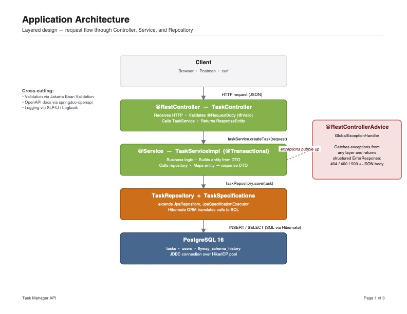
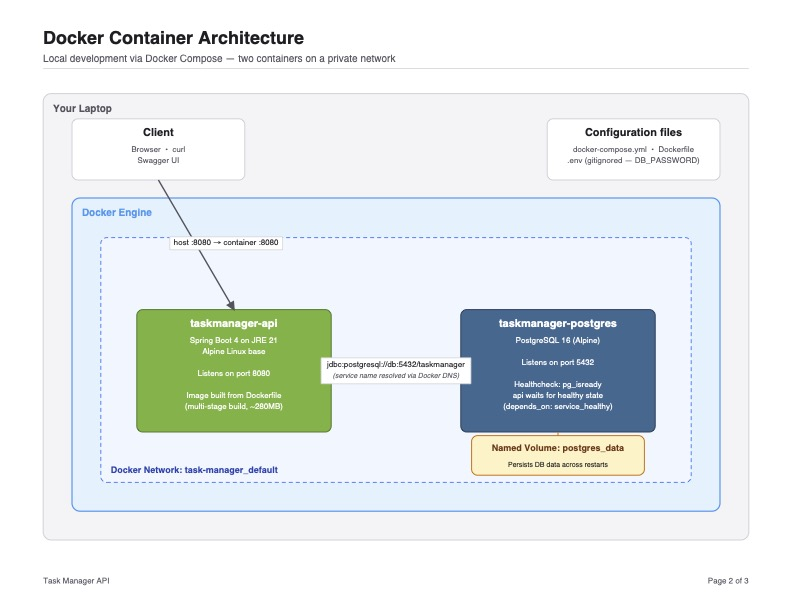
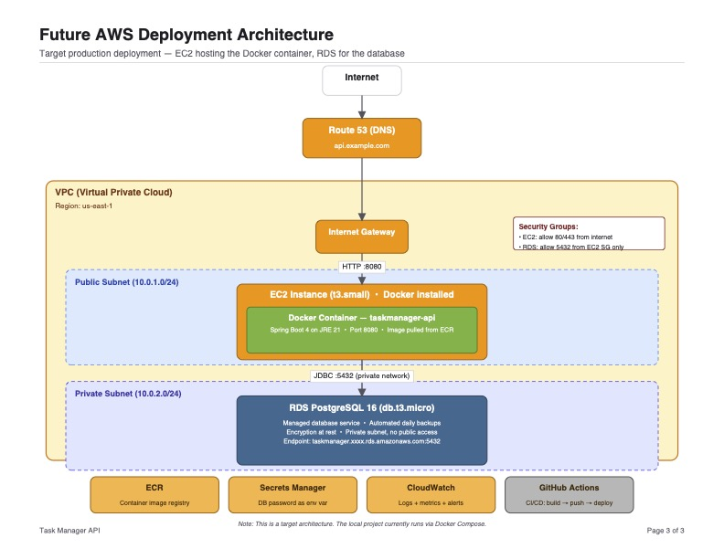

# Task Manager API

A RESTful task management API built with Spring Boot 4.x and PostgreSQL, containerised with Docker Compose. This project was built milestone-by-milestone as a learning exercise covering the full lifecycle of a production-ready Spring Boot service.

---

## Technology Stack

| Technology | Version | Role |
|---|---|---|
| Java | 21 | Language / runtime |
| Spring Boot | 4.0.6 | Application framework |
| PostgreSQL | 16 | Relational database |
| Flyway | (managed by Spring Boot) | Database migrations |
| Docker | 24+ | Container runtime |
| Docker Compose | v2 | Multi-container orchestration |
| SpringDoc OpenAPI / Swagger UI | 3.0.3 | API documentation |
| Lombok | (managed by Spring Boot) | Boilerplate reduction |
| Maven | 3.9+ | Build tool |

---

## Architecture

### Application Architecture
> Layered design — request flow through Controller, Service, and Repository



### Docker Container Architecture
> Local development via Docker Compose — two containers on a private network



### Future AWS Deployment Architecture
> Target production deployment — EC2 hosting the Docker container, RDS for the database



---

## Running Locally with Docker Compose

### Prerequisites

- **Java 21** — required to build the project locally (not needed if you only use Docker)
- **Docker Desktop** — includes the Docker daemon and Docker Compose v2
- **Docker Compose v2** — verify with `docker compose version`

### Steps

1. **Clone the repository**

   ```bash
   git clone <repo-url>
   cd task-manager
   ```

2. **Create the environment file**

   ```bash
   cp .env.example .env   # or create .env manually
   ```

   The `.env` file must contain:

   ```env
   DB_PASSWORD=changeme_in_production
   ```

   > Change `changeme_in_production` to a strong password before deploying anywhere beyond your local machine.

3. **Build and start all services**

   ```bash
   docker compose up --build
   ```

   Docker Compose will:
   - Build the Spring Boot image using the multi-stage Dockerfile
   - Start the PostgreSQL container and wait for it to pass its `pg_isready` health check
   - Start the API container; Flyway runs migrations automatically on startup

4. **Verify the API is healthy**

   ```bash
   curl http://localhost:8080/actuator/health
   ```

   Expected response:

   ```json
   {"status":"UP"}
   ```

5. **Explore the API with Swagger UI**

   Open your browser at: [http://localhost:8080/swagger-ui.html](http://localhost:8080/swagger-ui.html)

6. **Stop the services**

   ```bash
   docker compose down
   ```

   To also remove the database volume (destroys all data):

   ```bash
   docker compose down -v
   ```

---

## API Endpoints

Base path: `/api/v1/tasks`

| Method | Path | Description | Success Status |
|---|---|---|---|
| `POST` | `/api/v1/tasks` | Create a new task | `201 Created` |
| `GET` | `/api/v1/tasks` | List tasks (filtering, sorting, pagination) | `200 OK` |
| `GET` | `/api/v1/tasks/{id}` | Get a single task by UUID | `200 OK` |
| `PUT` | `/api/v1/tasks/{id}` | Replace a task with new data | `200 OK` |
| `DELETE` | `/api/v1/tasks/{id}` | Delete a task by UUID | `204 No Content` |

### Query parameters for `GET /api/v1/tasks`

| Parameter | Type | Default | Description |
|---|---|---|---|
| `status` | `TaskStatus` | — | Filter by status: `TODO`, `IN_PROGRESS`, `DONE` |
| `priority` | `TaskPriority` | — | Filter by priority: `LOW`, `MEDIUM`, `HIGH` |
| `sortBy` | `string` | `createdAt` | Field to sort by (e.g. `title`, `dueDate`, `priority`) |
| `sortDir` | `string` | `asc` | Sort direction: `asc` or `desc` |
| `page` | `int` | `0` | Zero-based page number |
| `size` | `int` | `20` | Page size (max: 100) |

### Example request

```bash
curl "http://localhost:8080/api/v1/tasks?status=TODO&priority=HIGH&sortBy=dueDate&sortDir=asc&page=0&size=10"
```

---

## What I Learned

### Milestone 1 — Project Scaffold

Set up a Spring Boot project from scratch using Spring Initializr and Maven.

Key concepts:
- **Spring Boot auto-configuration** — the framework inspects the classpath and wires beans automatically (e.g. `DataSource`, `EntityManagerFactory`) without XML config.
- **Maven dependency management** — the `spring-boot-starter-parent` BOM pins compatible versions for all Spring dependencies, eliminating version conflicts.
- **Actuator health endpoint** — `spring-boot-starter-actuator` exposes `/actuator/health` out of the box, giving a simple liveness check that Docker and load balancers can poll.

---

### Milestone 2 — Flyway Migrations

Introduced Flyway to manage the database schema as versioned SQL scripts.

Key concepts:
- **Database versioning** — each migration file (`V1__`, `V2__`, `V3__`) is applied exactly once and recorded in the `flyway_schema_history` table, giving a full audit trail of schema changes.
- **Idempotent migrations** — once applied, a migration is never re-run. This makes deployments safe to repeat and rollback strategies explicit.
- **Schema evolution without downtime** — additive changes (new columns with defaults, new tables) can be applied while the old application version is still running, enabling zero-downtime deploys.

---

### Milestone 3 — JPA Entity & DTOs

Modelled the `Task` entity and its associated DTOs.

Key concepts:
- **ORM mapping** — JPA annotations (`@Entity`, `@Table`, `@Column`, `@Enumerated`) map Java classes to database tables without writing SQL for CRUD operations.
- **Lombok boilerplate reduction** — `@Data`, `@Builder`, `@NoArgsConstructor`, and `@AllArgsConstructor` generate getters, setters, `equals`, `hashCode`, and constructors at compile time, keeping entity classes concise.
- **Java records for immutable DTOs** — `record` types (e.g. `TaskResponse`, `CreateTaskRequest`) are immutable by design, making them ideal for data transfer where mutation is undesirable.
- **Enum mapping with `EnumType.STRING`** — storing `TaskStatus` and `TaskPriority` as strings (`TODO`, `HIGH`) rather than ordinals makes the database readable and resilient to enum reordering.
- **`@ManyToOne` relationship** — `Task` has a nullable foreign key to `User` with `ON DELETE SET NULL`, meaning deleting a user orphans their tasks rather than cascading the delete.
- **`OffsetDateTime` for `dueDate`** — stores timezone offset alongside the timestamp, avoiding ambiguity when clients are in different time zones.

---

### Milestone 4 — Service Layer

Implemented the business logic layer between the controller and the repository.

Key concepts:
- **Repository pattern** — `TaskRepository` extends `JpaRepository`, providing standard CRUD methods without any SQL. The service layer depends on the interface, not the implementation.
- **JPA Specifications for dynamic queries** — `TaskSpecifications` builds `Predicate` objects at runtime to filter by `status` and `priority` without writing multiple query methods or raw SQL.
- **Pagination with Spring Data** — `Pageable` and `Page<T>` handle offset/limit, total count, and page metadata automatically. The controller just passes page/size parameters through.
- **`@Transactional` semantics** — annotating service methods ensures that all database operations within a method either commit together or roll back together, preventing partial updates.

---

### Milestone 5 — REST Controller

Exposed the service layer as a REST API.

Key concepts:
- **RESTful design** — resources are nouns (`/tasks`), HTTP verbs express intent (`POST` to create, `PUT` to replace, `DELETE` to remove), and status codes communicate outcomes.
- **HTTP status codes** — `201 Created` for new resources, `200 OK` for successful reads/updates, `204 No Content` for deletes, `404 Not Found` when a resource doesn't exist, `400 Bad Request` for validation failures.
- **`@Valid` bean validation** — placing `@Valid` on `@RequestBody` parameters triggers Jakarta Bean Validation constraints (`@NotBlank`, `@Size`, `@NotNull`) before the method body executes.
- **`ResponseEntity`** — wraps the response body with explicit control over the HTTP status code and headers, making the API contract clear in the code.

---

### Milestone 6 — Exception Handling

Centralised error handling with a consistent response format.

Key concepts:
- **`@RestControllerAdvice`** — a single class intercepts exceptions thrown anywhere in the controller layer and maps them to structured JSON responses, avoiding duplicated try/catch blocks.
- **Structured error responses** — the `ErrorResponse` record provides a consistent shape (`timestamp`, `status`, `error`, `message`) so API consumers can parse errors programmatically.
- **Validation error aggregation** — `MethodArgumentNotValidException` carries all constraint violations; the handler collects them into a list so the client sees every field error in one response rather than one at a time.

---

### Milestone 7 — Checkpoint

End-to-end integration verification of all layers working together.

Key concepts:
- Verified that the full request lifecycle (HTTP → Controller → Service → Repository → DB → back) works correctly with a real database.
- Confirmed Flyway migrations run cleanly on a fresh schema and that the API returns correct responses for all five endpoints.

---

### Milestone 8 — Docker

Containerised the application and orchestrated it with Docker Compose.

Key concepts:
- **Multi-stage Docker builds** — the `builder` stage (`eclipse-temurin:21-jdk-alpine`) compiles the JAR; the `runtime` stage (`eclipse-temurin:21-jre-alpine`) copies only the JAR, producing a smaller final image without build tools.
- **Docker Compose service orchestration** — `docker-compose.yml` declares both services, their environment variables, port mappings, and the dependency order (`depends_on` with `condition: service_healthy`).
- **Health checks** — the `pg_isready` health check on the `db` service prevents the API from starting before PostgreSQL is ready to accept connections.
- **Named volumes** — `postgres_data` persists database files across container restarts without binding to a host path, keeping the setup portable.
- **Environment variable injection** — `${DB_PASSWORD}` in `docker-compose.yml` reads from `.env` at runtime, keeping secrets out of version control.

---

### Milestone 9 — OpenAPI / Swagger UI

Added auto-generated API documentation.

Key concepts:
- **SpringDoc auto-generation** — `springdoc-openapi-starter-webmvc-ui` inspects Spring MVC annotations at startup and generates an OpenAPI 3 spec at `/v3/api-docs` with no extra configuration.
- **`@Operation` / `@Schema` annotations** — enrich the generated spec with human-readable summaries, descriptions, and example values that appear in Swagger UI.
- **Swagger UI** — the bundled UI at `/swagger-ui.html` lets developers explore and test every endpoint interactively without a separate tool.

---

### Milestone 10 — Documentation

Wrote the project README.

Key concepts:
- **Technical writing** — good documentation answers "what is this?", "how do I run it?", and "how do I use it?" in that order, matching the reader's mental journey from discovery to usage.
- **README as a first impression** — for a portfolio or open-source project, the README is often the first thing a recruiter or collaborator reads. A clear architecture diagram, working code snippets, and a "What I Learned" section demonstrate both technical depth and communication skills.
